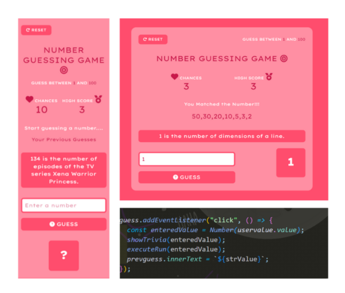

# Number-guessing-game-
# 🎯 Number Guessing Game

A simple and interactive **Number Guessing Game** built with **HTML, Tailwind CSS, and JavaScript**. It features real-time number trivia, a scoring system, and smooth animations to enhance user experience.

---

## 🚀 Demo  
🔗 [Live Preview] <a href="https://radha-7git.github.io/Number-guessing-game-/">https://radha-7git.github.io/Number-guessing-game-/</a>

---

## 📸 Screenshots
| Game UI | 
|---------|
|  |

---

## 💡 Features
✅ **Random Number Generation** – The game selects a random number between 1 and 100.  
✅ **User Input & Validation** – Users enter guesses, and the game provides hints (higher/lower).  
✅ **Live Score Tracking** – A score counter keeps track of remaining attempts.  
✅ **High Score System** – The game saves the best score for competitive play.  
✅ **Trivia API Integration** – Fetches fun number-related facts using the Numbers API.  
✅ **Responsive Design** – Styled using Tailwind CSS for a clean and adaptable UI.  
✅ **Smooth Animations** – A flipping effect when the correct number is guessed.  

---

## 🛠️ Technologies Used
- **HTML** – Structuring the game layout.  
- **Tailwind CSS** – Styling and responsiveness.  
- **JavaScript (DOM Manipulation)** – Game logic and interactivity.  
- **Numbers API** – Fetching trivia related to guessed numbers.  

